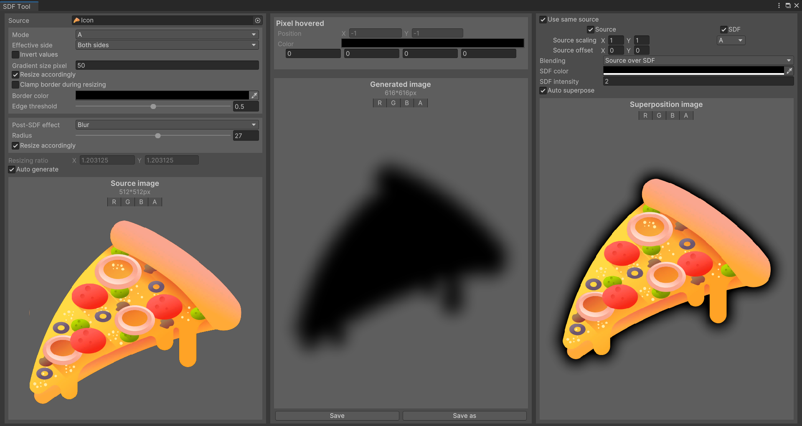
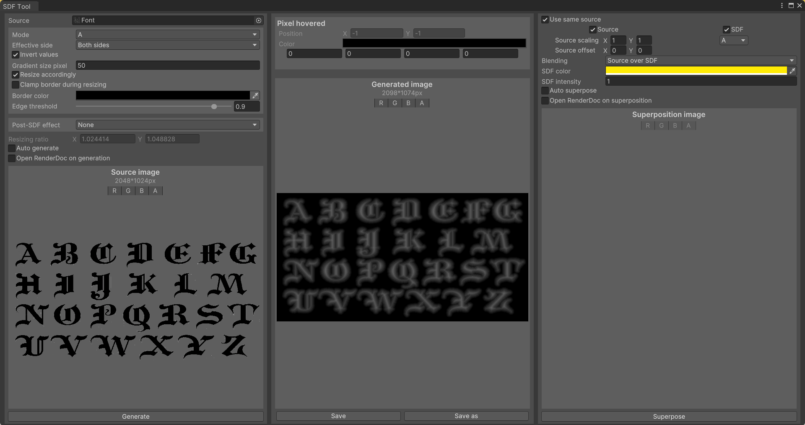

# Unity-SDF-Generator
This is a free-to-use SDF texture generator toolkit for Unity.

It can be used to create sprite outlines, generate implicit font atlases, or simply pre-calculate SDFs for other uses.

## Installation and use

To install this toolkit, just dowload the `SDFGenerator` folder and place it anywhere in your project's `Assets` folder.

Then, you can open the SDF Generator window with the shortcut `Ctrl+G` or by going in `Tools > SDF Generator`.

Select a source image, tweak the generation parameters on the left panel, and then click on the *Generate* button or the *Auto generate* toggle.
Depending on what you aim to do, you might want to visualise the generated SDF as an outline.
This can be done with the right panel, by clicking on the *Superpose* button or the *Auto superpose* button.

Beware that the tool might be laggy if you toggle on the auto generation and auto superposition while tweaking parameters, especially for large picture.

For each texture viewer, you can enable and disable the R, G, B and A channels, and access to a pixel value by hovering over it with the mouse, allowing you to check precisely what is in each channel.

## Additional information

You can change the access to the tool in the `SDFGenerator.cs` file, right before the `ShowWindow()` method.

You can use RenderDoc if you want to debug the SDF generation process.
To do so, first load RenderDoc with the shortcut `Alt+C` or click *Load RenderDoc* on either Game or Scene view's options.
Then, in the SDF Generator window, click on the *Open RenderDoc on generation* (and/or *Open RenderDoc on superposition*) button.
Note that you cannot activate this option and *Auto generate* at the same time.